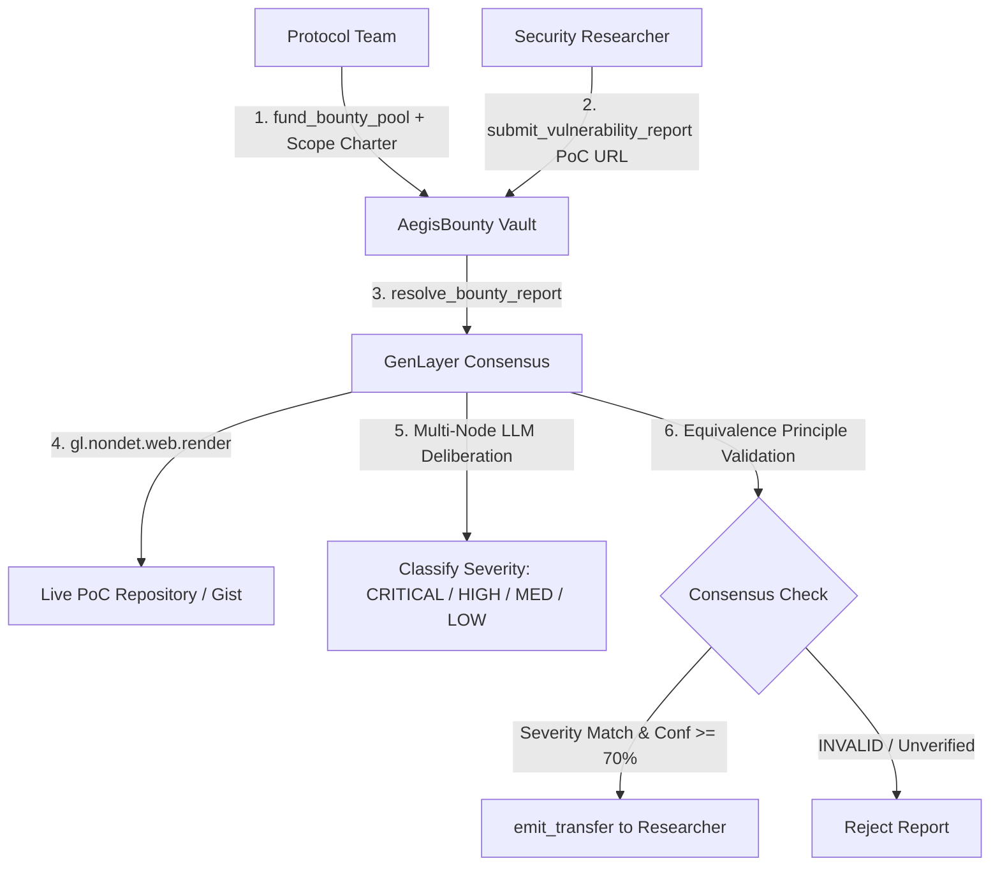

# AegisBounty Architecture

## 1. Executive Summary

**AegisBounty** is a decentralized bug bounty and vulnerability disclosure adjudication control plane built natively for GenLayer. It eliminates the conflict of interest inherent in traditional bug bounty programs by locking protocol reward pools on-chain and using multi-validator AI consensus over live exploit proof-of-concept (PoC) repositories.

## 2. Severity Payout Matrix

| Classification | Typical Impact | Basis Points (BPS) | Reward Allocation |
| :--- | :--- | :--- | :--- |
| **CRITICAL** | Direct fund drain, arbitrary execution, permanent state freeze | `5000 bps` | 50% of Total Bounty Pool |
| **HIGH** | Temporary asset lock, unauthorized governance parameter disruption | `2000 bps` | 20% of Total Bounty Pool |
| **MEDIUM** | Denial of service, griefing attack, severe gas drain | `500 bps` | 5% of Total Bounty Pool |
| **LOW / INVALID** | Minor informational typo, unverified claim | `0 bps` | Rejected (0 GEN) |

## 3. Trustless Security Guarantees

1. **Substantive Equivalence Principle**: Validators must agree on the actual classified severity (`CRITICAL`, `HIGH`, `MEDIUM`, `LOW`, `INVALID`) and confidence within $\pm 15\%$, avoiding format-only validation loopholes.
2. **Live Web Inspection**: Validators fetch real-time reproduction code using `gl.nondet.web.render`.
3. **Autonomous Transfer**: Escrow releases are triggered via `gl.chain.Account(researcher).emit_transfer()`.
